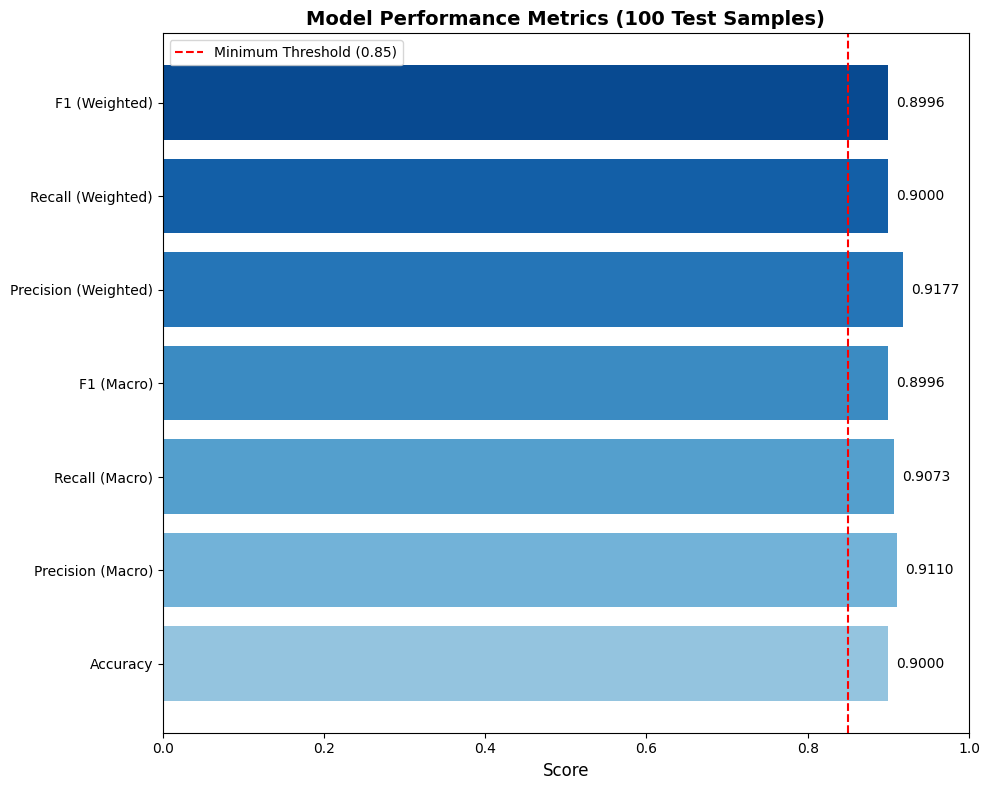
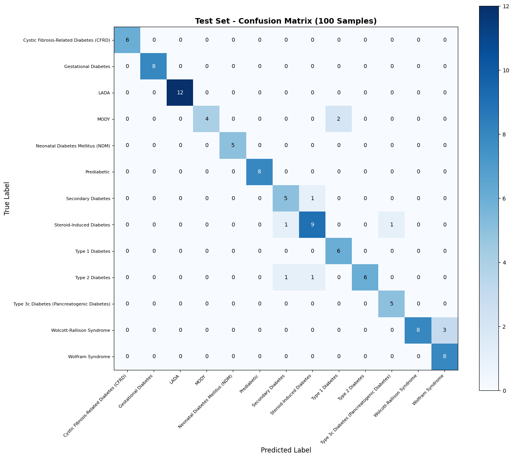
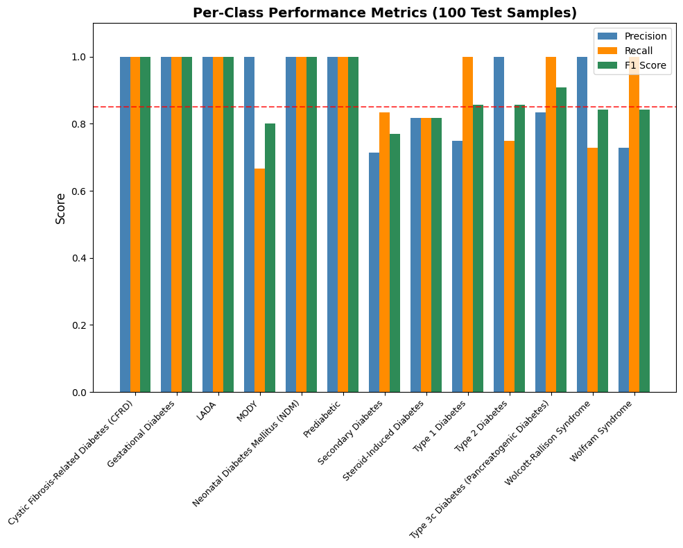
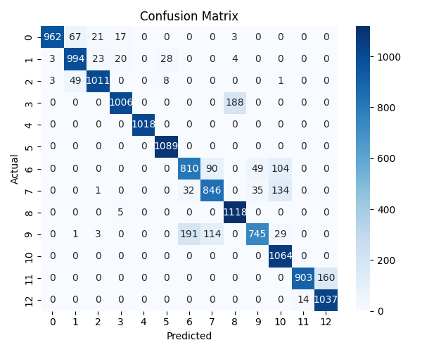

# Diabetes Prediction System 🩺

> Predict 13 types of diabetes from clinical data using Machine Learning


A machine learning project to classify diabetes types from clinical data using Random Forest classifier.

---

## Features

- ✅ Data preprocessing (missing values, encoding)
- ✅ Random Forest classifier
- ✅ Model persistence (pickle)
- ✅ Confusion matrix visualization
- ✅ Model testing with 100 random samples
- ✅ Performance metrics (accuracy, precision, recall, F1)
- ✅ JSON test logs

---

## Quick Start

```bash
# Train the model
cd src
python main.py

# Test the model with 100 random samples
python run_test.py
```

---

## Test Results

| Metric | Value |
|--------|-------|
| **Samples Tested** | 100 |
| **Accuracy** | 90.00% |
| **Correct Predictions** | 90/100 |
| **Precision (Macro)** | 0.911 |
| **Recall (Macro)** | 0.907 |
| **F1 Score (Macro)** | 0.900 |

---

## Visualizations

### Test Accuracy Metrics


*Overall model performance*

### Test Confusion Matrix


*Predictions across 13 diabetes types*

### Per-Class Performance


*Precision, Recall, F1 per class*

### Training Confusion Matrix


*Full training dataset results*

---

## Project Structure

```
diabetesPre/
├── db/diabetesDataset.csv          # 70,000 samples
├── models/diabetesModel.pkl        # Trained model
├── images/                         # Visualizations
├── test_logs.json                  # Test results
└── src/
    ├── config.py                   # Settings
    ├── main.py                     # Training
    ├── MLtrain.py                  # Model
    ├── proData.py                  # Data processing
    ├── run_test.py                 # Testing
    ├── test_data.py                # Test data loader
    ├── test_testing.py             # Test functions
    └── test_plots.py               # Visualizations
```

---

## GitHub & HuggingFace

- [GitHub](https://github.com/nayaksomkar/diabetesPre)
- [HuggingFace](https://huggingface.co/nayaksomkar/DiabetesPre)